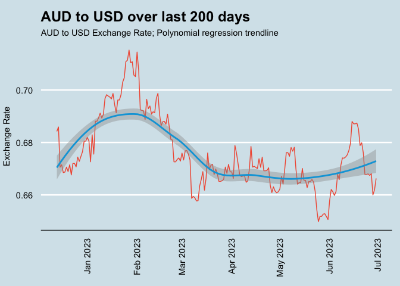
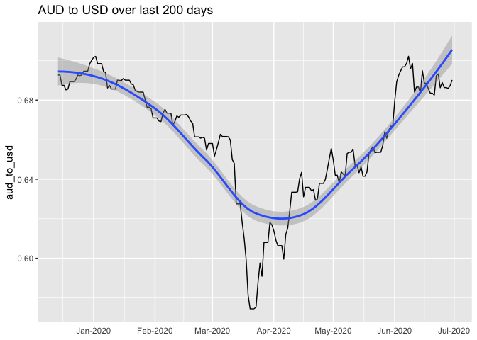
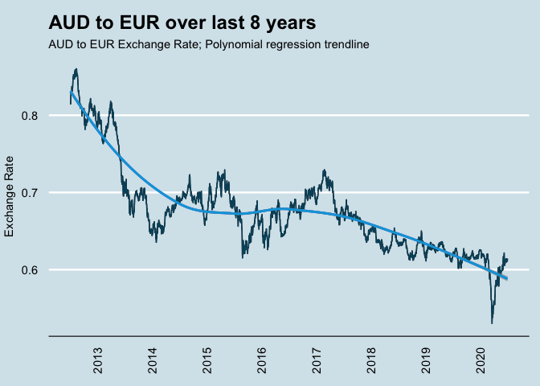

# priceR <a href='https://github.com/stevecondylios/priceR'></a>

<!-- badges: start -->

[](https://cran.r-project.org/package=priceR)
[](https://github.com/stevecondylios/priceR/actions?workflow=R-CMD-check)
<!-- badges: end -->

`priceR` contains 4 types of capabilties:

-   *Exchange Rates* - easily retrieve exchange rates for immediate use
-   *Inflation* - easily inflate past (nominal) values into present day
    (real) prices
-   *Regular Expressions* - easily extract common pricing patterns from
    free text
-   *Formatting* - easily handle currencies in written work, including
    Rmarkdown documents

### Installation

Installation via CRAN `install.packages("priceR")`

``` r
library(priceR)
library(tidyverse)
options(scipen = 100); options(digits = 6)
```

### Retrieve current exchange rates

Works for 170 currencies

``` r
exchange_rate_latest("USD") %>% 
  head(10)
```

    ## Daily USD exchange rate as at end of day 2022-03-20 GMT

    ##    currency one_usd_is_equivalent_to
    ## 1       AED                  3.67028
    ## 2       AFN                 88.92454
    ## 3       ALL                111.45574
    ## 4       AMD                486.96704
    ## 5       ANG                  1.80086
    ## 6       AOA                455.60708
    ## 7       ARS                109.44314
    ## 8       AUD                  1.34618
    ## 9       AWG                  1.79952
    ## 10      AZN                  1.69876

### View available currencies

``` r
currencies() %>%
  head()
```

    ##                     description code
    ## 1   United Arab Emirates Dirham  AED
    ## 2                Afghan Afghani  AFN
    ## 3                  Albanian Lek  ALL
    ## 4                 Armenian Dram  AMD
    ## 5 Netherlands Antillean Guilder  ANG
    ## 6                Angolan Kwanza  AOA

### Retrieve historical exchange rates

``` r
# Retieve AUD to USD exchange rates
au <- historical_exchange_rates("AUD", to = "USD",
                          start_date = "2010-01-01", end_date = "2020-06-30")

# Retieve AUD to EUR exchange rates
ae <- historical_exchange_rates("AUD", to = "EUR",
                          start_date = "2010-01-01", end_date = "2020-06-30")

# Combine
cur <- au %>% left_join(ae, by = "date")

head(cur)
```

    ##         date one_AUD_equivalent_to_x_USD one_AUD_equivalent_to_x_EUR
    ## 1 2010-01-01                    0.898084                    0.624103
    ## 2 2010-01-02                    0.898084                    0.624103
    ## 3 2010-01-03                    0.898084                    0.624103
    ## 4 2010-01-04                    0.912623                    0.632711
    ## 5 2010-01-05                    0.912011                    0.634840
    ## 6 2010-01-06                    0.920736                    0.639223

### Plot exchange rates

``` r
library(ggplot2)
library(ggthemes)
library(ggrepel)

cur %>% 
  rename(aud_to_usd = one_AUD_equivalent_to_x_USD,
         aud_to_eur = one_AUD_equivalent_to_x_EUR) %>% 
  pivot_longer(c("aud_to_usd", "aud_to_eur")) %>% 
  mutate(date = as.Date(date)) %>% 
  ggplot(aes(x=date, y = value, colour=name)) +
  geom_line(size=1) + 
  scale_color_manual(
    breaks = c("aud_to_usd", "aud_to_eur"), # Sets order in legend
    labels = c( "AUD to USD", "AUD to EUR"), # Pretty names in legend
    values = c("#02506A", "#03A5DC") # Sets line/legend colours
    ) + 
  scale_x_date(date_labels = "%b %Y", date_breaks = "6 month") +
  scale_y_continuous(
    expand = c(0, 0), 
    limits = c(0, 1.5)
    ) +
  labs(
    title = "AUD to USD and EUR 2010 to 2020",
    subtitle = "Plotting the Australian Dollar against the USD and Euro",
    y = "Exchange Rate"
    ) +
  theme_economist() + 
  theme(
    plot.title = element_text(size = 18, margin=margin(0,0,8,0)),
    axis.title.x = element_blank(),
    axis.ticks.x = element_blank(),
    axis.text.x = element_text(angle = 90, vjust = 0.5, hjust=1),
    axis.title.y = element_text(vjust = 3.5),
    legend.position="bottom",
    legend.title = element_blank()
    ) 
```

<!-- -->

``` r
cur %>% 
  tail(200) %>% 
  rename(aud_to_usd = one_AUD_equivalent_to_x_USD,
         aud_to_eur = one_AUD_equivalent_to_x_EUR) %>%  
  mutate(date = as.Date(date)) %>% 
  ggplot(aes(x = date, y = aud_to_usd, group = 1)) +
  geom_line(colour = "#F15B40") +
  geom_smooth(method = 'loess', colour="#03A5DC") + 
  scale_x_date(date_labels = "%b %Y", date_breaks = "1 month") +
  labs(
    title = "AUD to USD over last 200 days",
    subtitle = "AUD to USD Exchange Rate; Polynomial regression trendline",
    y = "Exchange Rate"
    ) +
  theme_economist() + 
  theme(
    plot.title = element_text(size = 18, margin=margin(0,0,8,0)),
    axis.title.x = element_blank(),
    axis.ticks.x = element_blank(),
    axis.text.x = element_text(angle = 90, vjust = 0.5, hjust=1),
    axis.title.y = element_text(vjust = 3.5),
    legend.position="bottom",
    legend.title = element_blank()
    ) 
```

<!-- -->

``` r
cur %>% 
  tail(365 * 8) %>% 
  rename(aud_to_usd = one_AUD_equivalent_to_x_USD,
         aud_to_eur = one_AUD_equivalent_to_x_EUR) %>% 
  mutate(date = as.Date(date)) %>% 
  ggplot(aes(x = date, y = aud_to_eur, group = 1)) +
  geom_line() +
  geom_smooth(method = 'loess', se = TRUE) + 
  geom_line(colour = "#02506A") +
  geom_smooth(method = 'loess', colour="#03A5DC") + 
  scale_x_date(date_labels = "%Y", date_breaks = "1 year") +
  labs(
    title = "AUD to EUR over last 8 years",
    subtitle = "AUD to EUR Exchange Rate; Polynomial regression trendline",
    y = "Exchange Rate"
    ) +
  theme_economist() + 
  theme(
    plot.title = element_text(size = 18, margin=margin(0,0,8,0)),
    axis.title.x = element_blank(),
    axis.ticks.x = element_blank(),
    axis.text.x = element_text(angle = 90, vjust = 0.5, hjust=1),
    axis.title.y = element_text(vjust = 3.5),
    legend.position="bottom",
    legend.title = element_blank()
    ) 
```

<!-- -->

### Adjust prices for inflation

`adjust_for_inflation()` automatically converts between nominal and real
dollars, or in/deflates prices from one year’s prices to another’s.

It works for any of 304 countries / areas. See them with all with
`show_countries()`

``` r
set.seed(123)
nominal_prices <- rnorm(10, mean=10, sd=3)
years <- round(rnorm(10, mean=2006, sd=5))
df <- data.frame(years, nominal_prices)

df$in_2008_dollars <- adjust_for_inflation(nominal_prices, years, "US", to_date = 2008)
```

    ## Generating URL to request all 299 results
    ## Retrieving inflation data for US 
    ## Generating URL to request all 61 results

``` r
df
```

    ##    years nominal_prices in_2008_dollars
    ## 1   2012        8.31857         7.66782
    ## 2   2008        9.30947         9.30947
    ## 3   2008       14.67612        14.67612
    ## 4   2007       10.21153        10.60356
    ## 5   2003       10.38786        12.15782
    ## 6   2015       15.14519        13.26473
    ## 7   2008       11.38275        11.38275
    ## 8   1996        6.20482         8.51713
    ## 9   2010        7.93944         7.67319
    ## 10  2004        8.66301         9.87471

### Extraction helpers: extract useful numeric data from messy free text

`extract_salary()` extracts salaries as useful numeric data from
non-standard free text

``` r
messy_salary_data <- c(
  "$90000 - $120000 per annum",
  "$90k - $110k p.a.",
  "$110k - $120k p.a. + super + bonus + benefits",
  "$140K-$160K + Super + Bonus/Equity",
  "$200,000 - $250,000 package",
  "c$200K Package Neg",
  "$700 p/d",                                       # daily
  "$120 - $140 (Inc. Super) per hour",              # hourly
  "Competitive"                                     # nothing useful
)

messy_salary_data %>%
  extract_salary(include_periodicity = TRUE, 
                 salary_range_handling = "average")
```

    ##   salary periodicity
    ## 1 105000      Annual
    ## 2 100000      Annual
    ## 3 115000      Annual
    ## 4 150000      Annual
    ## 5 225000      Annual
    ## 6 200000      Annual
    ## 7 175000       Daily
    ## 8 260000      Hourly
    ## 9     NA      Annual

### Neatly format currencies

`format_currency()` makes nicely formats numeric data:

``` r
format_currency("22500000", "¥")
```

    ## [1] "¥22,500,000"

`format_dollars()` is the same but exclusively for dollars:

``` r
format_dollars(c("445.50", "199.99"), digits = 2)
```

    ## [1] "$445.50" "$199.99"

# Issues and Feature Requests

When reporting an issue, please include:

-   Example code that reproduces the **observed** behavior.
-   An explanation of what the **expected** behavior is.
-   A specific url you’re attempting to retrieve R code from (if that’s
    what your issue concerns)

For feature requests, raise an issue with the following:

-   The desired functionality
-   Example inputs and desired output

# Pull Requests

Pull requests are welcomed. Before doing so, please create an issue or
email me with your idea.

Any new functions should follow the conventions established by the the
package’s existing functions. Please ensure

-   Functions are sensibly named
-   The **intent** of the contribution is clear
-   At least one example is provided in the documentation
